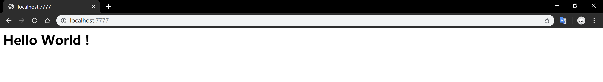
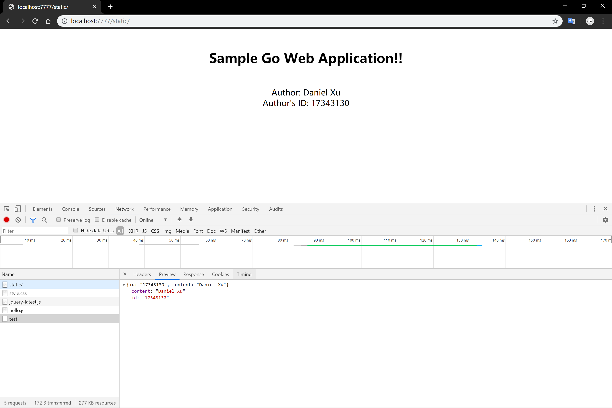
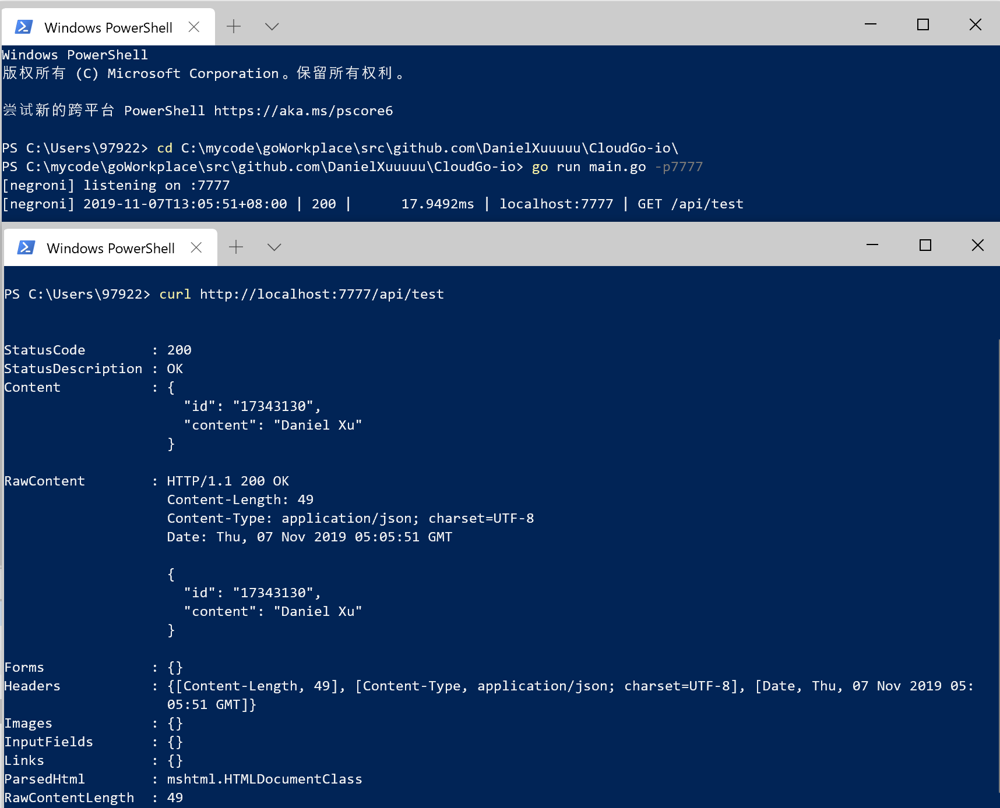
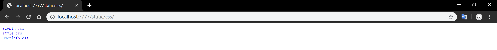
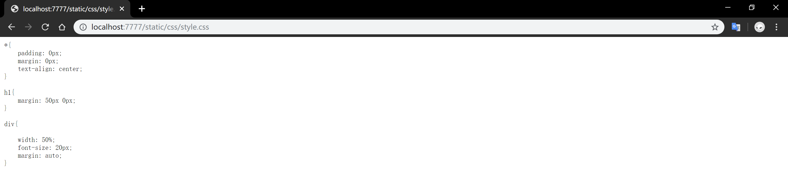
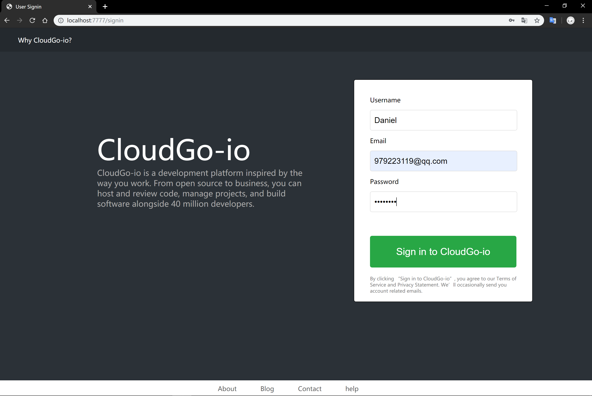
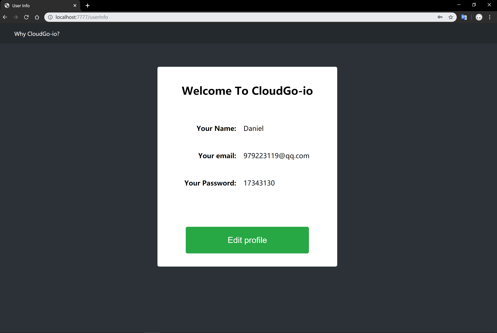
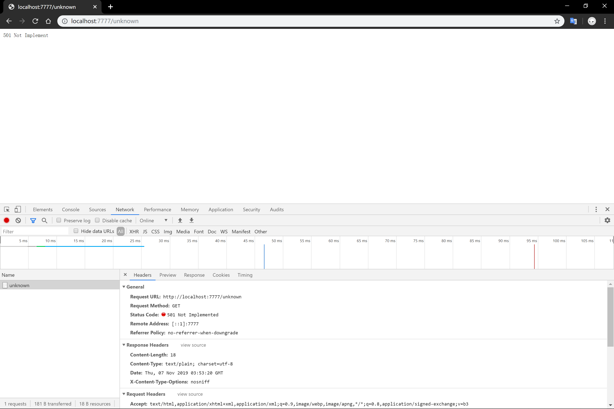
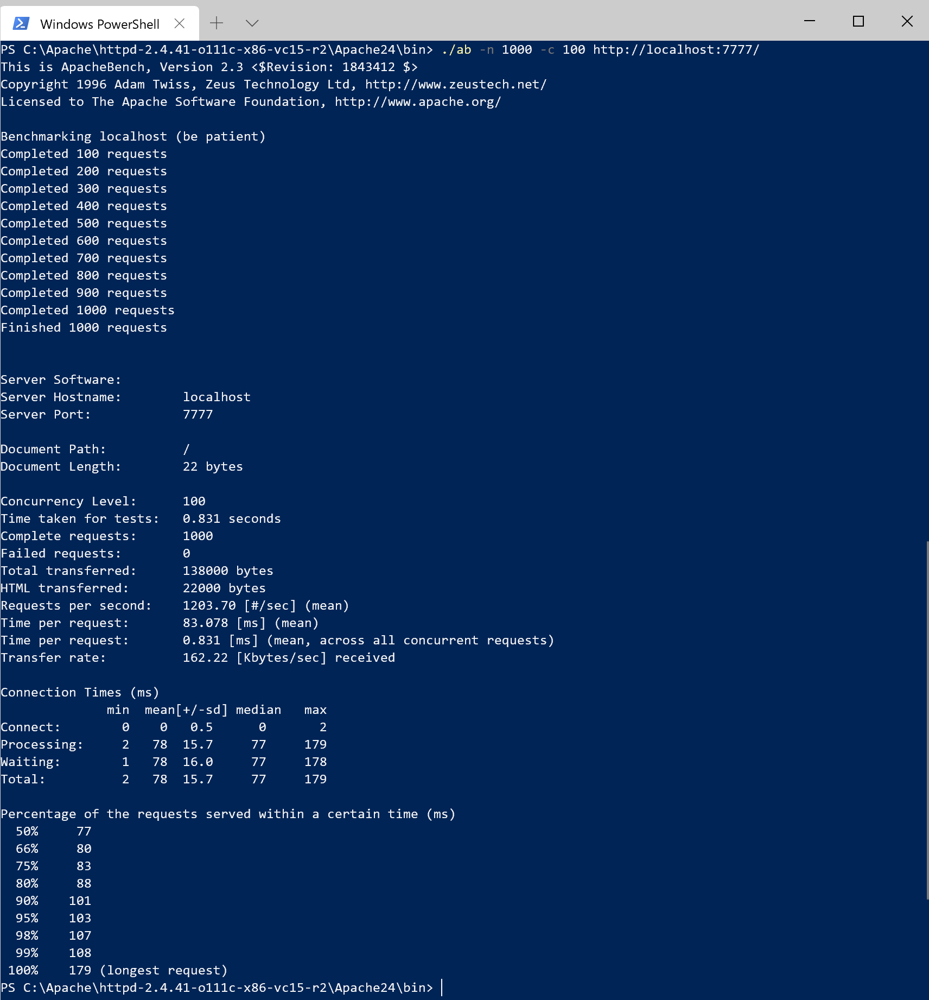

# CloudGo-io

一个极其简单的web服务程序

[参考博客1](https://blog.csdn.net/pmlpml/article/details/78404838 )	[参考博客2](https://blog.csdn.net/pmlpml/article/details/78539261 )

#### 使用方式

```/
// download CloudGo-io
go get github.com/DanielXuuuuu/CloudGo-io

// download packages
go get github.com/spf13/pflag
go get github.com/urfave/negroni
go get github.com/gorilla/mux
go get github.com/unrolled/render

// run CloudGo-io
go run main.go [-p]
```

`-p`指定监听端口号，默认为8080

#### 任务目标

+ 熟悉 go 服务器工作原理
+ 基于现有 web 库，编写一个简单 web 应用类似 cloudgo
  + 支持静态文件服务
  + 支持简单 js 访问
  + 提交表单，并输出一个表格
  + 对 `/unknown` 给出开发中的提示，返回码 `5xx`
+ 使用 curl 工具访问 web 程序
+ 对 web 执行压力测试

#### 框架使用

[negroni](https://github.com/urfave/negroni)

实际上，Negroni不是一个框架，它是为了方便使用 `net/http` 而设计的一个库而已。由于本次作业中使用Negroni已经可以实现全部功能，我就没有使用框架。 

Negroni 是Web 中间件，是一个具备微型、非嵌入式、鼓励使用原生 `net/http` 库特征的中间件。 

#### 测试

+ 测试环境：Windows 10 版本号1903

+ 运行终端：Windows Terminal (Preview)

+ 测试方式：浏览器访问

##### 启动


##### 首页



##### 静态资源

在`static`文件夹中添加了`.html`文件后，就会显示如下网页，而不是资源列表

该页面在加载时，会通过`Ajax`请求` http://localhost:7777/api/test `，得到作者（我）的姓名和ID。



我们通过curl工具访问，可以看的更清楚



查看`static/css`文件夹



查看`style.css`文件具体内容



##### 用户登入页面

按提示填写信息后，点击按钮提交表单



##### 用户详情页面

登入后返回用户信息表格



##### Unknown错误页面

返回码为501



#### AB压力测试

AB的全称为Apache Bench，是Apache自带的网络压力测试工具， 用以测试HTTP请求的服务器性能，也是业界比较流行和简单易用的一种压力测试工具包。

测试结果如下：



##### 参数解释

+ -n requests：在测试会话中所执行的请求总个数；
+ -c concurrency：一次产生的请求个数。默认是一次一个。 
